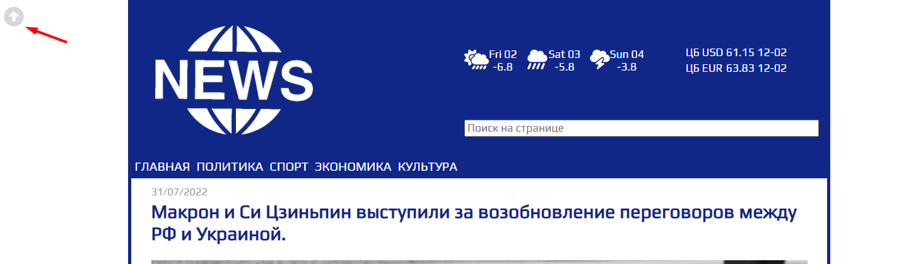
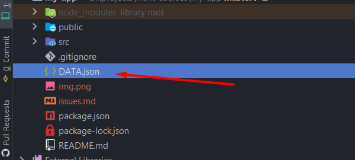
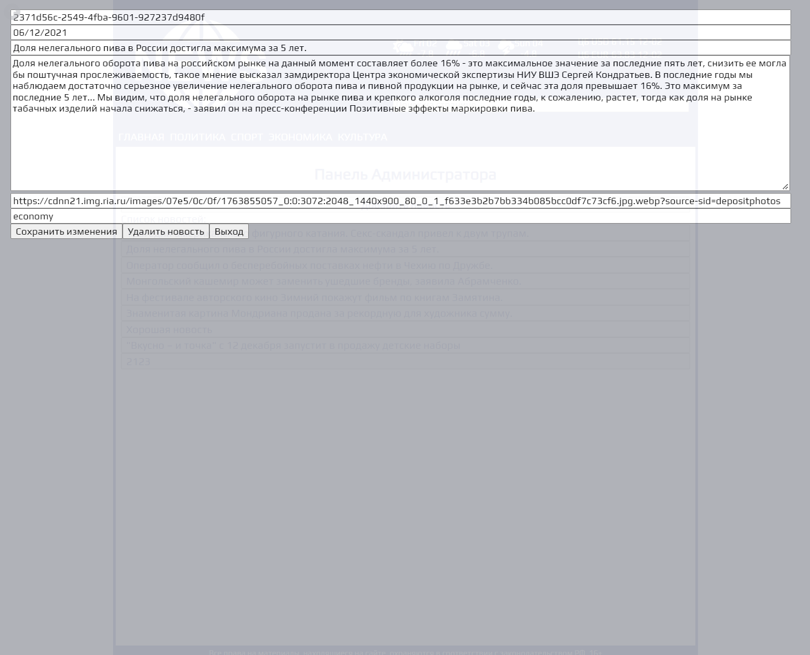
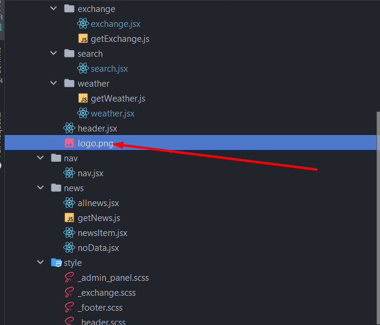

1. Правильнее сделать чтоб в ленте, выводились только первые N символов новости, если новость слишком большая, то она
   займет приличный кусок страницы. Чтобы посмотреть полностью новость надо открыть её в отдельной странице. Так будет
   правильнее и с точки зрения UX. Например https://lenta.ru/
2. При наведении должен быть cursor:pointer поскольку это кнопка + нет смысла показывать её если ты на самом верху
   страницы 
3. Не надо называть файл капсом 
4. Отсутствует валидация при создании/редактировании формы
5. При редактировании новости она просто удаляется
6. Стили набросан
7. UI не самый лучший, попробуй улучшить 
8. Запусти автоформатирование на весь проект, много проблем с форматированием
9. Перенести 
